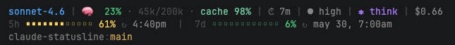

# claude-statusline

Minimal statusline for [Claude Code](https://claude.ai/code) — shows model, context usage, cache hit rate, session time, effort level, cost, rate limits, and current repo/branch.



## What it shows

**Line 1** — session info:
- Model name (shortened) — with `⚡` when fast mode is on
- 🧠 Context usage — percent + tokens used/total + cache hit %
- ⏱ Session duration
- Effort level indicator (`◔` low → `◉` xhigh)
- `✱ think` when extended thinking is enabled
- Session cost in USD

**Line 2** — rate limits (hidden when not available):
- 5-hour window — usage bar + reset time
- 7-day window — usage bar + reset date

**Line 3** — repo + branch (hidden when not in a git repo)

Colors shift from green → yellow → orange → red as usage increases.

## Requirements

- [Claude Code](https://claude.ai/code) v2.1+
- `jq`
- `bash`

Install `jq` if needed:
```bash
# macOS
brew install jq

# Ubuntu/Debian
apt install jq
```

## Install

```bash
npx github:slpuh/claude-statusline
```

Restart Claude Code after installation.

## Remove

```bash
npx github:slpuh/claude-statusline --remove
```

## License

MIT
